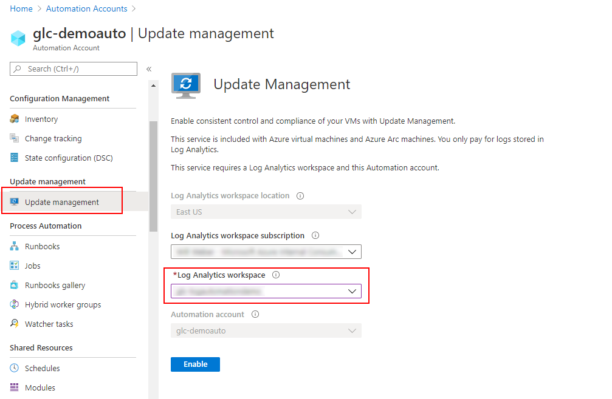
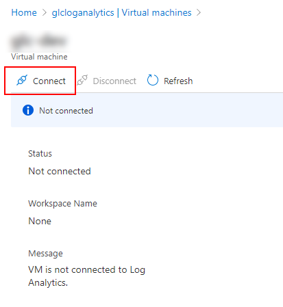
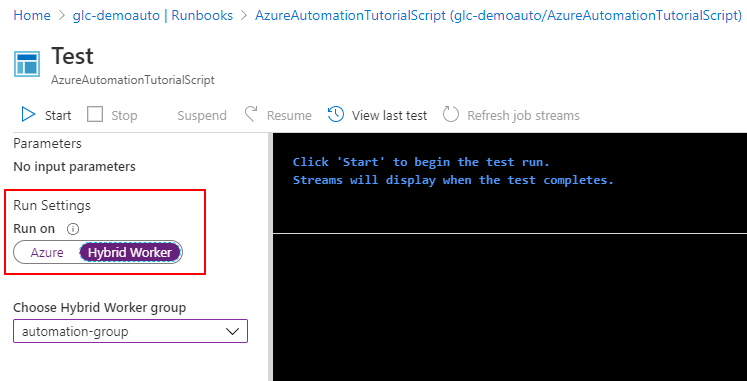
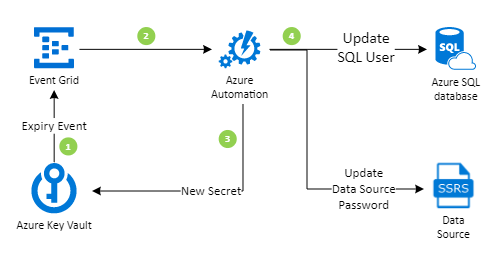

# Using Azure Automation and Hybrid Runbook Workers to Update an SSRS Data Source
## Azure Services Required for the Solution:
  - Automation Account
  - Log Analytics
  - Key Vault
  - Virtual Machine(s) running SSRS and Hybrid Worker Agent

## Process Flow


## Basic Steps
- Create Log Analytics and Automation Account in supported linking regions. [List here](https://docs.microsoft.com/en-us/azure/automation/how-to/region-mappings)
- Add Virtual Machine to Log Analytics Workspace.
- Deploy Log Analytics Agent to the Virtual Machine and download the Automation Feature.
- Install necessary PowerShell cmdlets to the Virtual Machine.
  - [Az.Accounts](https://docs.microsoft.com/en-us/powershell/module/az.accounts/?view=azps-4.1.0), [Az.KeyVault](https://docs.microsoft.com/en-us/powershell/module/az.keyvault/?view=azps-4.1.0), [Reporting Services Tools](https://github.com/Microsoft/ReportingServicesTools)
- Setup Managed Service Identity (MSI) on Virtual Machine
- Grant MSI permissions on Key Vault.
- Execute Runbook on Hybrid Worker.

## Getting it all to work - Detailed Steps

### Option 1: Automated Deployment 

Use the Automated Deployment script outlined [here](https://docs.microsoft.com/en-us/azure/automation/automation-windows-hrw-install#manual-deployment). The recommended deployment method is to use Azure Automation to automatically configure a new worker.

### Option 2: Manual Setup 

There is manual setup documentation [here](https://docs.microsoft.com/en-us/azure/automation/automation-windows-hrw-install#manual-deployment), however it leverages PowerShell and a number of branching documentation pages. I thought I would collect and document the process using the Azure Portal.

1. Setup an Automation Account (*note see #3)
2. Setup a Log Analytics Workspace (*note see #3)
3. **Make sure they are both in a region that supports linked workspaces.** [List here](https://docs.microsoft.com/en-us/azure/automation/how-to/region-mappings)
4. Link Automation Account and Log Analytics
	- Select **Update management** in the Automation Account and choose the correct Log Analytics Workspace from the list.

	

5. Add Virtual Machine to Log Anayltics Workspace (this should deploy the Log Analytics Agent)

	

	

6. Add the Hybrid Runbook Worker Role to the Virtual Machine through the Monitoring Agent. This also creates a Hybrid Worker Group. ([instructions here](https://docs.microsoft.com/en-us/azure/automation/automation-windows-hrw-install#step-4---install-the-runbook-environment-and-connect-to-azure-automation))

	Install the PowerShell module to add the worker role. This module is automatically copied to the machine when the Log Analaytics Agent is pushed down. Run this in an Administrator PowerShell session
	```
	cd "C:\Program Files\Microsoft Monitoring Agent\Agent\AzureAutomation\<version>\HybridRegistration"
	Import-Module .\HybridRegistration.psd1
	```
	Then add the VM to a Hybrid Worker Group

	```
	Add-HybridRunbookWorker –GroupName <String> -EndPoint <Url> -Token <String>
	```
	
	EndPoint and Token information can be pulled from the Automation Account -> Account Settings -> Keys blade.

	

7. The command below will execute the runbook on the provided hybrid worker group

	```
	Start-AzureRmAutomationRunbook –AutomationAccountName <AccountName> –Name <RunbookName> -RunOn <HybridWorkerGroupName>
	```

	- Test executions can also be run on the Hybrid Worker as well by selecting the Hybrid Worker slider and choosing the Hybrid Workgroup Group.

	

## Authentication
- Choose [Managed Service Identity](https://docs.microsoft.com/en-us/azure/automation/automation-hrw-run-runbooks#runbook-auth-managed-identities) or [Run As account with certificate](https://docs.microsoft.com/en-us/azure/automation/automation-hrw-run-runbooks#use-runbook-authentication-with-run-as-account)

## Troubleshooting
I had an issue on Windows Server 2016 with PowerShell cmdlets not installing correctly. It turned out that my server was not communicating using TLS1.2 and I had to force it through with the following command

```
[Net.ServicePointManager]::SecurityProtocol = [Net.SecurityProtocolType]::Tls12
```

## Extending the Pattern

An example pattern to fully automate the key rotation might look like this:

1. Key Vault expiry event is sent to Event Grid
2. Event Grid kicks off an Azure Automation runbook(s)
3. A new Secret is generated and stored in Key Vault
4. Updated passwords are sent to SQL DB and SSRS

